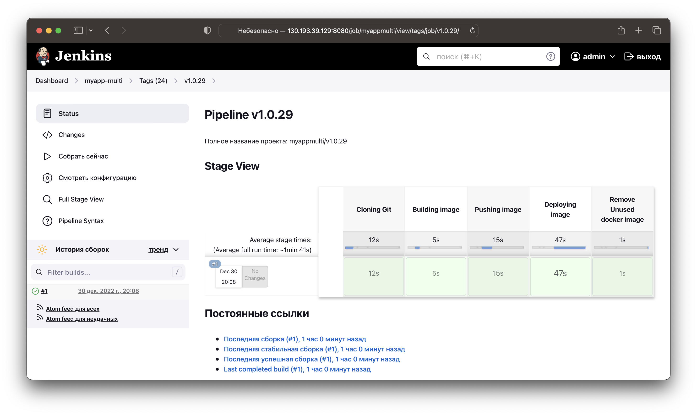

# Дипломная работа netology

  * [Цели:](#цели)
  * [Этапы выполнения:](#этапы-выполнения)
     * [Создание облачной инфраструктуры](#создание-облачной-инфраструктуры)
     * [Создание Kubernetes кластера](#создание-kubernetes-кластера)
     * [Создание тестового приложения](#создание-тестового-приложения)
     * [Подготовка cистемы мониторинга и деплой приложения](#подготовка-cистемы-мониторинга-и-деплой-приложения)
     * [Установка и настройка CI/CD](#установка-и-настройка-cicd)

## Цели:

1. Подготовить облачную инфраструктуру на базе облачного провайдера Яндекс.Облако.
2. Запустить и сконфигурировать Kubernetes кластер.
3. Установить и настроить систему мониторинга.
4. Настроить и автоматизировать сборку тестового приложения с использованием Docker-контейнеров.
5. Настроить CI для автоматической сборки и тестирования.
6. Настроить CD для автоматического развёртывания приложения.

Исходники:
- [Terraform](terraform)
- [Prometheus](kube-prometheus)
- [Qbec конифигурация Kubernetes кластера](app)
- [Приложение](https://github.com/belas80/myapp.git)

## Этапы выполнения:  

### Создание облачной инфраструктуры  

Backend для Terraform будет храниться в S3 bucket. Для работы с бакетом используется отдельная сервисная учетка с ролью 
`storage.editor`.  
Конфиг [backend.tf](terraform/backend.tf):  
```terraform
terraform {
  backend "s3" {
    endpoint                    = "storage.yandexcloud.net"
    bucket                      = "belas80-tf-states-netology"
    key                         = "main/terraform.tfstate"
    region                      = "ru-central1"
    profile                     = "netology"
    skip_region_validation      = true
    skip_credentials_validation = true
  }
}
```

Выполнение первоначальной инициализации:  
```shell
% terraform init             

Initializing the backend...

Successfully configured the backend "s3"! Terraform will automatically
use this backend unless the backend configuration changes.

Initializing provider plugins...
- Reusing previous version of yandex-cloud/yandex from the dependency lock file
- Installing yandex-cloud/yandex v0.82.0...
- Installed yandex-cloud/yandex v0.82.0 (unauthenticated)

Terraform has been successfully initialized!

You may now begin working with Terraform. Try running "terraform plan" to see
any changes that are required for your infrastructure. All Terraform commands
should now work.

If you ever set or change modules or backend configuration for Terraform,
rerun this command to reinitialize your working directory. If you forget, other
commands will detect it and remind you to do so if necessary.
```

Создание workspaces:  
```shell
% terraform workspace new stage
Created and switched to workspace "stage"!

You're now on a new, empty workspace. Workspaces isolate their state,
so if you run "terraform plan" Terraform will not see any existing state
for this configuration.

% terraform workspace new prod 
Created and switched to workspace "prod"!

You're now on a new, empty workspace. Workspaces isolate their state,
so if you run "terraform plan" Terraform will not see any existing state
for this configuration.

% terraform workspace list
  default
* prod
  stage
```

Проверка что появилось в бакете S3:  
```shell
% aws s3 --endpoint-url=https://storage.yandexcloud.net ls s3://belas80-tf-states-netology/ --recursive --profile netology 
2022-11-22 16:08:37        180 env:/prod/main/terraform.tfstate
2022-11-22 16:08:31        180 env:/stage/main/terraform.tfstate
```

VPC с подсетями в разных зонах доступности определен в файле [network.tf](terraform/network.tf)  
Проверка созадния ресурсов:  
```shell
% terraform apply -auto-approve
...
...
Plan: 4 to add, 0 to change, 0 to destroy.
yandex_vpc_network.lab-net: Creating...
yandex_vpc_network.lab-net: Creation complete after 3s [id=enpgbe7428ah9f32cu1p]
yandex_vpc_subnet.private-c: Creating...
yandex_vpc_subnet.private-b: Creating...
yandex_vpc_subnet.private-a: Creating...
yandex_vpc_subnet.private-c: Creation complete after 0s [id=b0c3gum86823igdo6v0g]
yandex_vpc_subnet.private-a: Creation complete after 1s [id=e9b34nrmpufvc5ub0l8g]
yandex_vpc_subnet.private-b: Creation complete after 2s [id=e2ldjqg488qn0dc93ao7]

Apply complete! Resources: 4 added, 0 changed, 0 destroyed.
```
Проверка удаления ресурсов:  
```shell
% terraform destroy -auto-approve
...
...
Plan: 0 to add, 0 to change, 4 to destroy.
yandex_vpc_subnet.private-b: Destroying... [id=e2ldjqg488qn0dc93ao7]
yandex_vpc_subnet.private-c: Destroying... [id=b0c3gum86823igdo6v0g]
yandex_vpc_subnet.private-a: Destroying... [id=e9b34nrmpufvc5ub0l8g]
yandex_vpc_subnet.private-b: Destruction complete after 2s
yandex_vpc_subnet.private-c: Destruction complete after 5s
yandex_vpc_subnet.private-a: Destruction complete after 6s
yandex_vpc_network.lab-net: Destroying... [id=enpgbe7428ah9f32cu1p]
yandex_vpc_network.lab-net: Destruction complete after 1s

Destroy complete! Resources: 4 destroyed.
```

---
### Создание Kubernetes кластера  

Для создания кластера подготовим две инстанс группы, для Control Plane  [instance-group-cp.tf](terraform/instance-group-cp.tf) 
и для рабочих нод [instance-group-nodes.tf](terraform/instance-group-nodes.tf). Количесво хостов будет зависить от текущего воркспейса, которые определены в [variables.tf](terraform/variables.tf#L13).
Для воркспейса `stage` будет одна control plane и две рабочих ноды, а для `prod` будет 3 control plane и 3 рабочих ноды.  
Кластер будет в приватной сети, доступ к инетрету организован через nat ([instance-nat.tf](terraform/instance-nat.tf)) в отдельной публичной сети.
Так же этот инстанс будет использован в качестве бастиона для разворачивания k8s.  
Подготовим network load balancer для доступа к нашим contor plane по внешнему IP адресу [balancer-cp.tf](terraform/balancer-cp.tf).  
  
После применения конфигурации terraform, задеплоим k8s с помощью kubespray. Для этого подготовим файл интвентори с помощью bash скрипта [gen_k8s_inventory.sh](terraform/gen_k8s_inventory.sh).
Скрипт выведет в стандартный вывод значения из output терраформа, а мы перенаправим их нужное нам место, например:  
```shell
./gen_k8s_inventory.sh > ~/netology/kubespray2/inventory/mycluster/inventory.ini
```
Пример готового инвернтори [inventory.ini](kubespray_inventory/inventory.ini).  
Этого достаточно для деплоя:  
```shell
ansible-playbook -i inventory/mycluster/inventory.ini --become cluster.yml
```
После того как кластер k8s развернется, скопируем конфиг kubectl с любой control plane ноды себе на компьютер и поменяем IP кластера в нем на внешний адрес нашего load balancer для мастеров.
С помощью скрипта bash [get_k8s_config.sh](terraform/get_k8s_config.sh), конфиг по умолчнанию скопируется в домашнюю директорию `~/.kube/config`  
```shell
./get_k8s_config.sh
```
  
Результат:  

```shell
# Инстансы
 % yc compute instance list
+----------------------+-------+---------------+---------+--------------+---------------+
|          ID          | NAME  |    ZONE ID    | STATUS  | EXTERNAL IP  |  INTERNAL IP  |
+----------------------+-------+---------------+---------+--------------+---------------+
| ef3e6ujbvvn0ll9pjobd | node2 | ru-central1-c | RUNNING |              | 192.168.22.34 |
| epd1gum2c9l6lq5tjkpa | node1 | ru-central1-b | RUNNING |              | 192.168.21.9  |
| epdg9utmmrgbsfdi49lb | cp1   | ru-central1-b | RUNNING |              | 192.168.21.35 |
| fhmkbs1093990h4ekcel | nat   | ru-central1-a | RUNNING | 62.84.113.20 | 192.168.1.254 |
+----------------------+-------+---------------+---------+--------------+---------------+

# Инстанс группы
% yc compute instance-group list
+----------------------+----------+--------+------+
|          ID          |   NAME   | STATUS | SIZE |
+----------------------+----------+--------+------+
| cl1fi52qrsh3q6bajpnj | ig-cp    | ACTIVE |    1 |
| cl1i8hv2a46usa922oc5 | ig-nodes | ACTIVE |    2 |
+----------------------+----------+--------+------+

# Балансеры
 % yc load-balancer network-load-balancer list
+----------------------+---------------------+-------------+----------+----------------+------------------------+--------+
|          ID          |        NAME         |  REGION ID  |   TYPE   | LISTENER COUNT | ATTACHED TARGET GROUPS | STATUS |    
+----------------------+---------------------+-------------+----------+----------------+------------------------+--------+
| enpn9nn9itamve6tegn3 | nodes-load-balancer | ru-central1 | EXTERNAL |              1 | enpmket4ec55hi2pvjeu   | ACTIVE |
| enpr0826t77sdiea3kma | cp-load-balancer    | ru-central1 | EXTERNAL |              1 | enp4r73r93obl16cjkqn   | ACTIVE |
+----------------------+---------------------+-------------+----------+----------------+------------------------+--------+

# Таргет группа
% yc load-balancer network-load-balancer target-states --name=cp-load-balancer --target-group-id=enp4r73r93obl16cjkqn
+----------------------+---------------+---------+
|      SUBNET ID       |    ADDRESS    | STATUS  |
+----------------------+---------------+---------+
| e2lr7amvqvpjugas5sqa | 192.168.21.35 | HEALTHY |
+----------------------+---------------+---------+

% yc load-balancer network-load-balancer target-states --name=nodes-load-balancer --target-group-id=enpmket4ec55hi2pvjeu
+----------------------+---------------+---------+
|      SUBNET ID       |    ADDRESS    | STATUS  |
+----------------------+---------------+---------+
| b0c9jirv06s7v1sit00k | 192.168.22.34 | HEALTHY |
| e2lr7amvqvpjugas5sqa | 192.168.21.9  | HEALTHY |
+----------------------+---------------+---------+

# IP нашего балансировщика к мастерам
% terraform output -json lb_cp_external_ip
[[["51.250.94.150"]]]

# Копируем конфиг kubectl и проверяем работу k8s
% ./get_k8s_config.sh 

% kubectl cluster-info 
Kubernetes control plane is running at https://51.250.94.150:6443

To further debug and diagnose cluster problems, use 'kubectl cluster-info dump'.

% kubectl get nodes 
NAME    STATUS   ROLES           AGE    VERSION
cp1     Ready    control-plane   140m   v1.25.4
node1   Ready    <none>          139m   v1.25.4
node2   Ready    <none>          139m   v1.25.4
```

---
### Создание тестового приложения  

Репозиторий с простым nginx конфигом, dockerfile и html страничкой [здесь](https://github.com/belas80/myapp.git)
Регистр с собранным docker image [здесь](https://hub.docker.com/r/belas80/myapp/tags)

---
### Подготовка cистемы мониторинга и деплой приложения  

1. Задеплоить в кластер мониторинг. Воспользовался пакетом [kube-prometheus](https://github.com/prometheus-operator/kube-prometheus).
Конфиги prometheus находятся [здесь](kube-prometheus/manifests). Перед генерацией конфигов включил nodePort и отключил networkpolicies, для настройки доступа к нему с наружи [здесь](kube-prometheus/example.jsonnet#L6)
```shell
# Делой в кластер
kubectl apply --server-side -f manifests/setup
kubectl apply -f manifests/

# Проверка
% kubectl get -n monitoring deploy,po,svc
NAME                                  READY   UP-TO-DATE   AVAILABLE   AGE
deployment.apps/blackbox-exporter     1/1     1            1           91m
deployment.apps/grafana               1/1     1            1           91m
deployment.apps/kube-state-metrics    1/1     1            1           91m
deployment.apps/prometheus-adapter    2/2     2            2           91m
deployment.apps/prometheus-operator   1/1     1            1           92m

NAME                                       READY   STATUS    RESTARTS      AGE
pod/alertmanager-main-0                    2/2     Running   0             91m
pod/alertmanager-main-1                    2/2     Running   1 (91m ago)   91m
pod/alertmanager-main-2                    2/2     Running   0             91m
pod/blackbox-exporter-68d54c49dc-dvk24     3/3     Running   0             91m
pod/grafana-6cd5ccdcb8-x7wcq               1/1     Running   0             91m
pod/kube-state-metrics-84db6cc79c-rpd9b    3/3     Running   0             91m
pod/node-exporter-7f2vb                    2/2     Running   0             91m
pod/node-exporter-8gbbn                    2/2     Running   0             91m
pod/node-exporter-rgvsp                    2/2     Running   0             91m
pod/prometheus-adapter-757f9b4cf9-5kwx6    1/1     Running   0             91m
pod/prometheus-adapter-757f9b4cf9-k42f4    1/1     Running   0             91m
pod/prometheus-k8s-0                       2/2     Running   0             91m
pod/prometheus-k8s-1                       2/2     Running   0             91m
pod/prometheus-operator-7cf95bc44c-4rd67   2/2     Running   0             92m

NAME                            TYPE        CLUSTER-IP      EXTERNAL-IP   PORT(S)                      AGE
service/alertmanager-main       NodePort    10.233.44.162   <none>        9093:30903/TCP               91m
service/alertmanager-operated   ClusterIP   None            <none>        9093/TCP,9094/TCP,9094/UDP   91m
service/blackbox-exporter       ClusterIP   10.233.54.215   <none>        9115/TCP,19115/TCP           91m
service/grafana                 NodePort    10.233.14.91    <none>        3000:30902/TCP               91m
service/kube-state-metrics      ClusterIP   None            <none>        8443/TCP,9443/TCP            91m
service/node-exporter           ClusterIP   None            <none>        9100/TCP                     91m
service/prometheus-adapter      ClusterIP   10.233.52.69    <none>        443/TCP                      91m
service/prometheus-k8s          NodePort    10.233.50.105   <none>        9090:30900/TCP               91m
service/prometheus-operated     ClusterIP   None            <none>        9090/TCP                     91m
service/prometheus-operator     ClusterIP   None            <none>        8443/TCP                     92m
```
Дашборды графаны доступы на белом IP  


2. Воспользовался qbec для организации конфигурации тестового приложения и atlantis. Все исходники [здесь](app).  
Atlanis будет statefulset с постоянным хранилищем и перед деплоем его нужно подготовить. В качестве хранилище будет NFS сервер и для простоты воспользуемся helm.  
```shell
helm install nfs stable/nfs-server-provisioner
```
Конфиги атлантиса
- [atlantis.jsonnet](app/components/atlantis.jsonnet)
- [Репо сайд](atlantis.yaml)
- [Сервер сайд](app/config/repos.yaml)
```shell
# Деплой приложения
qbec apply stage --yes

# Проверка
% kubectl get deployments.apps 
NAME           READY   UP-TO-DATE   AVAILABLE   AGE
myapp-deploy   2/2     2            2           48m

# Деплой Атлантиса
qbec apply atlantis --yes

# Проверка
% kubectl -n devops-tools get sts
NAME       READY   AGE
atlantis   1/1     47s
```
Приложение доступно из браузера:  

Пример pull request с комментариями созданными atlantis'ом

Блокировки в вебморде Атлантиса

Коммент `atlantis apply -p stage` и вывод после успешного завершения apply

Вывод в вебморде Атлантиса


---
### Установка и настройка CI/CD

Для автоматической сборки docker image и деплоя приложения при изменении кода, задеплоил в куб Jenkins. Для агента собран докер образ
с необходимыми инструментами (docker, kubectl и qbec). На этом этапе собрал все инструменты (atlantis, jenkins и их секреты)
в один environment [devops-tools](app/environments/devops-tools.libsonnet) и в соответствуюещем неймспейсе.
- [Компонент Jenkins](app/components/jenkins.jsonnet)
- [Компонент Jenkins Agent](app/components/jenkins-agent.jsonnet)
- [Dockerfile агента Jenkins](app/docker/jenkins-agent/Dockerfile)

Деплой:  
```shell
qbec apply devops-tools -c jenkins -c jenkins-agent
```
Проверка всех devops-tools компонентов:  
```shell
 % qbec validate devops-tools                            
setting cluster to cluster.local
setting context to kubernetes-admin@cluster.local
cluster metadata load took 229ms
4 components evaluated in 11ms
✔ services atlantis -n devops-tools (source atlantis) is valid
✔ configmaps tf-provider-config -n devops-tools (source atlantis) is valid
✔ persistentvolumeclaims jenkins-agent-pv-claim -n devops-tools (source jenkins-agent) is valid
✔ deployments jenkins-agent -n devops-tools (source jenkins-agent) is valid
✔ statefulsets atlantis -n devops-tools (source atlantis) is valid
✔ clusterrolebindings jenkins-admin (source jenkins) is valid
✔ secrets devops-secrets -n devops-tools (source devops-secrets) is valid
✔ services jenkins-agent -n devops-tools (source jenkins-agent) is valid
✔ persistentvolumeclaims jenkins-pv-claim -n devops-tools (source jenkins) is valid
✔ serviceaccounts jenkins-admin -n devops-tools (source jenkins) is valid
✔ services jenkins-service -n devops-tools (source jenkins) is valid
✔ clusterroles jenkins-admin (source jenkins) is valid
✔ deployments jenkins -n devops-tools (source jenkins) is valid
---
stats:
  valid: 13

command took 430ms
```

В интерфейсе Jenkins создан Multibranch Pipeline, который тригерит на любой пушь и тэг в [репозирии приложения](https://github.com/belas80/myapp.git).
По пушу делается сборка и заргузка в репозиторий докер хаб, а если указать тэг вида v1.0.0, то дополнительно будет деплой в кластер.  
Пайплайн Jenkins в файле [Jenkinsfile](https://github.com/belas80/myapp/blob/main/Jenkinsfile), в корне репозитория приложения.  

Результаты:  
Интерфейс Jenkins

Вывод консоли на git push
```shell
Branch indexing
 > git rev-parse --resolve-git-dir /var/jenkins_home/caches/git-2ca317e22178ce86cb55b13261242818/.git # timeout=10
Setting origin to git@github.com:belas80/myapp.git
 > git config remote.origin.url git@github.com:belas80/myapp.git # timeout=10
Fetching origin...
Fetching upstream changes from origin
 > git --version # timeout=10
 > git --version # 'git version 2.30.2'
 > git config --get remote.origin.url # timeout=10
using GIT_SSH to set credentials 
 > git fetch --tags --force --progress -- origin +refs/heads/*:refs/remotes/origin/* # timeout=10
Seen branch in repository origin/main
Seen 1 remote branch
Obtained Jenkinsfile from dfe12fe1e34cdb8fc5e1112213e87edf43b93bcf
[Pipeline] Start of Pipeline
[Pipeline] node
Running on agent1 in /home/jenkins/agent/workspace/myappmulti_main
[Pipeline] {
[Pipeline] stage
[Pipeline] { (Cloning Git)
[Pipeline] git
Selected Git installation does not exist. Using Default
The recommended git tool is: NONE
using credential github
Cloning the remote Git repository
Cloning repository git@github.com:belas80/myapp.git
 > git init /home/jenkins/agent/workspace/myappmulti_main # timeout=10
Fetching upstream changes from git@github.com:belas80/myapp.git
 > git --version # timeout=10
 > git --version # 'git version 2.30.2'
using GIT_SSH to set credentials 
 > git fetch --tags --force --progress -- git@github.com:belas80/myapp.git +refs/heads/*:refs/remotes/origin/* # timeout=10
 > git config remote.origin.url git@github.com:belas80/myapp.git # timeout=10
 > git config --add remote.origin.fetch +refs/heads/*:refs/remotes/origin/* # timeout=10
Avoid second fetch
Checking out Revision dfe12fe1e34cdb8fc5e1112213e87edf43b93bcf (refs/remotes/origin/main)
 > git rev-parse refs/remotes/origin/main^{commit} # timeout=10
 > git config core.sparsecheckout # timeout=10
 > git checkout -f dfe12fe1e34cdb8fc5e1112213e87edf43b93bcf # timeout=10
 > git branch -a -v --no-abbrev # timeout=10
 > git checkout -b main dfe12fe1e34cdb8fc5e1112213e87edf43b93bcf # timeout=10
Commit message: "deploying"
 > git rev-list --no-walk 2860a8252f943c819be76b010ed219dcb9e50afa # timeout=10
[Pipeline] }
[Pipeline] // stage
[Pipeline] stage
[Pipeline] { (Building image)
[Pipeline] isUnix
[Pipeline] withEnv
[Pipeline] {
[Pipeline] sh
+ docker build -t belas80/myapp:43 .
Sending build context to Docker daemon  123.4kB

Step 1/3 : FROM nginx
 ---> 1403e55ab369
Step 2/3 : COPY index.html /usr/share/nginx/html
 ---> 8162455e4bbd
Step 3/3 : COPY nginx.conf /etc/nginx/conf.d/default.conf
 ---> 6d1e1f77c898
Successfully built 6d1e1f77c898
Successfully tagged belas80/myapp:43
[Pipeline] }
[Pipeline] // withEnv
[Pipeline] }
[Pipeline] // stage
[Pipeline] stage
[Pipeline] { (Pushing image)
[Pipeline] withEnv
[Pipeline] {
[Pipeline] withDockerRegistry
$ docker login -u belas80 -p ******** https://index.docker.io/v1/
WARNING! Using --password via the CLI is insecure. Use --password-stdin.
WARNING! Your password will be stored unencrypted in /home/jenkins/agent/workspace/myappmulti_main@tmp/4c5f6c91-57d2-45a8-8121-c9fb667fe432/config.json.
Configure a credential helper to remove this warning. See
https://docs.docker.com/engine/reference/commandline/login/#credentials-store

Login Succeeded
[Pipeline] {
[Pipeline] isUnix
[Pipeline] withEnv
[Pipeline] {
[Pipeline] sh
+ docker tag belas80/myapp:43 belas80/myapp:43
[Pipeline] }
[Pipeline] // withEnv
[Pipeline] isUnix
[Pipeline] withEnv
[Pipeline] {
[Pipeline] sh
+ docker push belas80/myapp:43
The push refers to repository [docker.io/belas80/myapp]
c33959237fae: Preparing
e13d1c218817: Preparing
c72d75f45e5b: Preparing
9a0ef04f57f5: Preparing
d13aea24d2cb: Preparing
2b3eec357807: Preparing
2dadbc36c170: Preparing
8a70d251b653: Preparing
2b3eec357807: Waiting
2dadbc36c170: Waiting
8a70d251b653: Waiting
c72d75f45e5b: Layer already exists
d13aea24d2cb: Layer already exists
9a0ef04f57f5: Layer already exists
2b3eec357807: Layer already exists
8a70d251b653: Layer already exists
2dadbc36c170: Layer already exists
c33959237fae: Pushed
e13d1c218817: Pushed
43: digest: sha256:e89b1a39ea9a962650a5ad584977e55ec131e92c418e4076fd895e0f41956c05 size: 1984
[Pipeline] }
[Pipeline] // withEnv
[Pipeline] }
[Pipeline] // withDockerRegistry
[Pipeline] }
[Pipeline] // withEnv
[Pipeline] }
[Pipeline] // stage
[Pipeline] stage
[Pipeline] { (Deploying image)
[Pipeline] }
[Pipeline] // stage
[Pipeline] stage
[Pipeline] { (Remove Unused docker image)
[Pipeline] sh
+ docker rmi belas80/myapp:43
Untagged: belas80/myapp:43
Untagged: belas80/myapp@sha256:e89b1a39ea9a962650a5ad584977e55ec131e92c418e4076fd895e0f41956c05
Deleted: sha256:6d1e1f77c898ddb95b3aab1e97f2fff9f9343266a21a3dad4a6c9bf95f94a4ce
Deleted: sha256:68ade8f36af5abd143fbbf92a1ceb6db6eb932ee147ba0fcea369720a244827c
Deleted: sha256:8162455e4bbd587f06581f6b83906f3288cb57a7c5e460f166cca534a97dae1a
Deleted: sha256:c5c2aea0f7372300ab1cd0740b89a28d94f7988ecd95c15a12e6a3288f6283ad
[Pipeline] }
[Pipeline] // stage
[Pipeline] }
[Pipeline] // node
[Pipeline] End of Pipeline
Finished: SUCCESS
```
Вывод консоли на git tag
```shell
Branch indexing
 > git rev-parse --resolve-git-dir /var/jenkins_home/caches/git-2ca317e22178ce86cb55b13261242818/.git # timeout=10
Setting origin to git@github.com:belas80/myapp.git
 > git config remote.origin.url git@github.com:belas80/myapp.git # timeout=10
Fetching origin...
Fetching upstream changes from origin
 > git --version # timeout=10
 > git --version # 'git version 2.30.2'
 > git config --get remote.origin.url # timeout=10
using GIT_SSH to set credentials 
 > git fetch --tags --force --progress -- origin +refs/heads/*:refs/remotes/origin/* # timeout=10
 > git rev-parse refs/tags/v1.0.29^{commit} # timeout=10
Obtained Jenkinsfile from dfe12fe1e34cdb8fc5e1112213e87edf43b93bcf
[Pipeline] Start of Pipeline
[Pipeline] node
Running on agent1 in /home/jenkins/agent/workspace/myappmulti_v1.0.29
[Pipeline] {
[Pipeline] stage
[Pipeline] { (Cloning Git)
[Pipeline] git
Selected Git installation does not exist. Using Default
The recommended git tool is: NONE
using credential github
Cloning the remote Git repository
Cloning repository git@github.com:belas80/myapp.git
 > git init /home/jenkins/agent/workspace/myappmulti_v1.0.29 # timeout=10
Fetching upstream changes from git@github.com:belas80/myapp.git
 > git --version # timeout=10
 > git --version # 'git version 2.30.2'
using GIT_SSH to set credentials 
 > git fetch --tags --force --progress -- git@github.com:belas80/myapp.git +refs/heads/*:refs/remotes/origin/* # timeout=10
 > git config remote.origin.url git@github.com:belas80/myapp.git # timeout=10
 > git config --add remote.origin.fetch +refs/heads/*:refs/remotes/origin/* # timeout=10
Avoid second fetch
Checking out Revision dfe12fe1e34cdb8fc5e1112213e87edf43b93bcf (refs/remotes/origin/main)
 > git rev-parse refs/remotes/origin/main^{commit} # timeout=10
 > git config core.sparsecheckout # timeout=10
 > git checkout -f dfe12fe1e34cdb8fc5e1112213e87edf43b93bcf # timeout=10
 > git branch -a -v --no-abbrev # timeout=10
Commit message: "deploying"
First time build. Skipping changelog.
 > git checkout -b main dfe12fe1e34cdb8fc5e1112213e87edf43b93bcf # timeout=10
[Pipeline] }
[Pipeline] // stage
[Pipeline] stage
[Pipeline] { (Building image)
[Pipeline] isUnix
[Pipeline] withEnv
[Pipeline] {
[Pipeline] sh
+ docker build -t belas80/myapp:v1.0.29 .
Sending build context to Docker daemon  124.4kB

Step 1/3 : FROM nginx
 ---> 1403e55ab369
Step 2/3 : COPY index.html /usr/share/nginx/html
 ---> b0107d9cfc4c
Step 3/3 : COPY nginx.conf /etc/nginx/conf.d/default.conf
 ---> 09a40b969f30
Successfully built 09a40b969f30
Successfully tagged belas80/myapp:v1.0.29
[Pipeline] }
[Pipeline] // withEnv
[Pipeline] }
[Pipeline] // stage
[Pipeline] stage
[Pipeline] { (Pushing image)
[Pipeline] withEnv
[Pipeline] {
[Pipeline] withDockerRegistry
$ docker login -u belas80 -p ******** https://index.docker.io/v1/
WARNING! Using --password via the CLI is insecure. Use --password-stdin.
WARNING! Your password will be stored unencrypted in /home/jenkins/agent/workspace/myappmulti_v1.0.29@tmp/0e9b58da-18b0-43a3-8f97-131603681da5/config.json.
Configure a credential helper to remove this warning. See
https://docs.docker.com/engine/reference/commandline/login/#credentials-store

Login Succeeded
[Pipeline] {
[Pipeline] isUnix
[Pipeline] withEnv
[Pipeline] {
[Pipeline] sh
+ docker tag belas80/myapp:v1.0.29 belas80/myapp:v1.0.29
[Pipeline] }
[Pipeline] // withEnv
[Pipeline] isUnix
[Pipeline] withEnv
[Pipeline] {
[Pipeline] sh
+ docker push belas80/myapp:v1.0.29
The push refers to repository [docker.io/belas80/myapp]
7f8796dace3d: Preparing
b98dee4f03e8: Preparing
c72d75f45e5b: Preparing
9a0ef04f57f5: Preparing
d13aea24d2cb: Preparing
2b3eec357807: Preparing
2dadbc36c170: Preparing
8a70d251b653: Preparing
2dadbc36c170: Waiting
8a70d251b653: Waiting
2b3eec357807: Waiting
9a0ef04f57f5: Layer already exists
c72d75f45e5b: Layer already exists
d13aea24d2cb: Layer already exists
2dadbc36c170: Layer already exists
2b3eec357807: Layer already exists
8a70d251b653: Layer already exists
7f8796dace3d: Pushed
b98dee4f03e8: Pushed
v1.0.29: digest: sha256:27447fd72d38f8968bf8b4efe860735caf718716998d755c2b2f65eae06dab0e size: 1984
[Pipeline] }
[Pipeline] // withEnv
[Pipeline] }
[Pipeline] // withDockerRegistry
[Pipeline] }
[Pipeline] // withEnv
[Pipeline] }
[Pipeline] // stage
[Pipeline] stage
[Pipeline] { (Deploying image)
[Pipeline] git
The recommended git tool is: NONE
using credential github
Fetching changes from the remote Git repository
 > git rev-parse --resolve-git-dir /home/jenkins/agent/workspace/myappmulti_v1.0.29/.git # timeout=10
 > git config remote.origin.url git@github.com:belas80/devops-diplom-netology.git # timeout=10
Fetching upstream changes from git@github.com:belas80/devops-diplom-netology.git
 > git --version # timeout=10
 > git --version # 'git version 2.30.2'
using GIT_SSH to set credentials 
 > git fetch --tags --force --progress -- git@github.com:belas80/devops-diplom-netology.git +refs/heads/*:refs/remotes/origin/* # timeout=10
Checking out Revision 4262829d77e61f09d93a0bb22e62264dc6be3bec (refs/remotes/origin/main)
 > git rev-parse refs/remotes/origin/main^{commit} # timeout=10
 > git config core.sparsecheckout # timeout=10
 > git checkout -f 4262829d77e61f09d93a0bb22e62264dc6be3bec # timeout=10
 > git branch -a -v --no-abbrev # timeout=10
 > git branch -D main # timeout=10
 > git checkout -b main 4262829d77e61f09d93a0bb22e62264dc6be3bec # timeout=10
Commit message: "fixed jenkis agent dockerfile"
First time build. Skipping changelog.
[Pipeline] dir
Running in /home/jenkins/agent/workspace/myappmulti_v1.0.29/app
[Pipeline] {
[Pipeline] sh
+ qbec apply stage --vm:ext-str myapp_image_tag=v1.0.29 --yes
setting cluster to cluster.local
setting context to kubernetes-admin@cluster.local
cluster metadata load took 85ms
1 components evaluated in 79ms

will synchronize 2 object(s)

1 components evaluated in 70ms
update deployments myapp-deploy -n default (source myapp)
server objects load took 219ms
---
stats:
  same: 1
  updated:
  - deployments myapp-deploy -n default (source myapp)

waiting for readiness of 1 objects
  - deployments myapp-deploy -n default

  0s    : deployments myapp-deploy -n default :: 1 out of 2 new replicas have been updated
  5s    : deployments myapp-deploy -n default :: 1 old replicas are pending termination
��� 9s    : deployments myapp-deploy -n default :: successfully rolled out (0 remaining)

��� 9s: rollout complete
command took 9.97s
[Pipeline] }
[Pipeline] // dir
[Pipeline] }
[Pipeline] // stage
[Pipeline] stage
[Pipeline] { (Remove Unused docker image)
[Pipeline] sh
+ docker rmi belas80/myapp:v1.0.29
Untagged: belas80/myapp:v1.0.29
Untagged: belas80/myapp@sha256:27447fd72d38f8968bf8b4efe860735caf718716998d755c2b2f65eae06dab0e
Deleted: sha256:09a40b969f30aed45f1d8b3ff8e57ea21555b9fb9f95fdb0273e21889de5e1f9
Deleted: sha256:6b3ad3bbeda479096a9da78d46a8e8d75af3eb9813f091ad656da421113acb69
Deleted: sha256:b0107d9cfc4c116045d93cddc7e042a1c4fbe18b734cb1c477f838f82083f702
Deleted: sha256:968ab8c2007a9f649b2db73cb948a872a90ad963891881f6f34f1d64ea00ce2d
[Pipeline] }
[Pipeline] // stage
[Pipeline] }
[Pipeline] // node
[Pipeline] End of Pipeline
Finished: SUCCESS
```